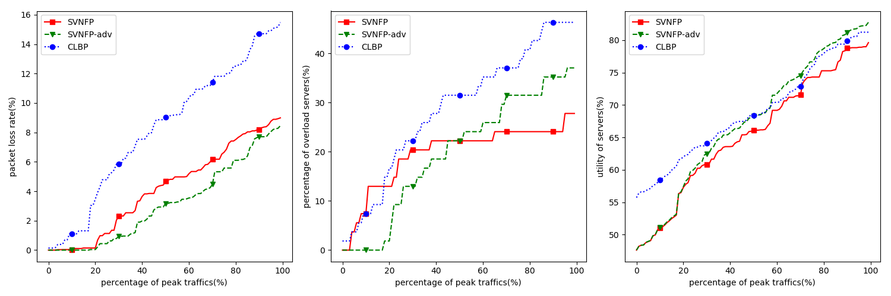

# 实验

取k=6, 共54台服务器  编号为[45,98]。

6个pod         [45-98]
每个pod3个tor   [45-53] ...
每个tor3台serv  [45-47] [48-50] [51-53] ...

## 实验1：

```shell
# --- k=6 c=10 s=20 ---
# 生成流量
python3 traffic.py -c 10 -k 6 -Tm 10 -al 2.1 -s 20 -o debug/traffic-c10s20.txt
python3 mvsh.py -k 6 -i debug/traffic-c10s20.txt -o debug/result_mvsh-c10s20.txt -n
python3 resultAnalysis.py -c 10 -k 6 -i debug/result_mvsh-c10s20.txt -o debug/analysis_mvsh-c10s20.txt
python3 plr.py -c 10 -k 6 -i debug/result_mvsh-c10s20.txt -s 20 -o debug/plr_mvsh-c10s20.txt -a mvsh
python3 svnfp.py -k 6 -i debug/traffic-c10s20.txt -o debug/result_svnf-c10s20.txt -n
python3 resultAnalysis.py -c 10 -k 6 -i debug/result_svnf-c10s20.txt -o debug/analysis_svnf-c10s20.txt
python3 plr.py -c 10 -k 6 -i debug/result_svnf-c10s20.txt -s 20 -o debug/plr_svnf-c10s20.txt -a svnf
python3 clbp.py -k 6 -i debug/traffic-c10s20.txt -o debug/result_clbp-c10s20.txt -n
python3 resultAnalysis.py -c 10 -k 6 -i debug/result_clbp-c10s20.txt -o debug/analysis_clbp-c10s20.txt
python3 plr.py -c 10 -k 6 -i debug/result_clbp-c10s20.txt -s 20 -o debug/plr_clbp-c10s20.txt -a clbp
python3 draw.py -c 10 -s 20
```

| 算法       | AR    | FLP（跳数） | AVG SU  |
| ---       | ---   | ---        | ---     |
| sVNFP     | 100%  |  3.803     |17.547%  |
| sVNFP-adv | 100%  |  2.025     | 4.094%  |
| CLBP      | 100%  |  1.271     |13.647%  |


## 实验2

```shell
# --- k=6 c=50 s=20 ---
# 生成流量
python3 traffic.py -c 50 -k 6 -Tm 10 -al 2.1 -s 20 -o debug/traffic-c50s20.txt
python3 mvsh.py -k 6 -i debug/traffic-c50s20.txt -o debug/result_mvsh-c50s20.txt -n
python3 resultAnalysis.py -c 50 -k 6 -i debug/result_mvsh-c50s20.txt -o debug/analysis_mvsh-c50s20.txt
python3 plr.py -c 50 -k 6 -i debug/result_mvsh-c50s20.txt -s 20 -o debug/plr_mvsh-c50s20.txt -a mvsh
python3 svnfp.py -k 6 -i debug/traffic-c50s20.txt -o debug/result_svnf-c50s20.txt -n
python3 resultAnalysis.py -c 50 -k 6 -i debug/result_svnf-c50s20.txt -o debug/analysis_svnf-c50s20.txt
python3 plr.py -c 50 -k 6 -i debug/result_svnf-c50s20.txt -s 20 -o debug/plr_svnf-c50s20.txt -a svnf
python3 clbp.py -k 6 -i debug/traffic-c50s20.txt -o debug/result_clbp-c50s20.txt -n
python3 resultAnalysis.py -c 50 -k 6 -i debug/result_clbp-c50s20.txt -o debug/analysis_clbp-c50s20.txt
python3 plr.py -c 50 -k 6 -i debug/result_clbp-c50s20.txt -s 20 -o debug/plr_clbp-c50s20.txt -a clbp
python3 draw.py -c 50 -s 20
```

| 算法       | AR    | FLP（跳数） | AVG SU  |
| ---       | ---   | ---        | ---     |
| sVNFP     | 100%  |  5.094     |26.127%  |
| sVNFP-adv | 100%  |  2.144     |26.127%  |
| CLBP      | 100%  |  1.078     |37.128%  |


## 实验3

```shell
# --- k=6 c=100 s=20 ---
# 生成流量
python3 traffic.py -c 100 -k 6 -Tm 10 -al 2.1 -s 20 -o debug/traffic-c100s20.txt
python3 mvsh.py -k 6 -i debug/traffic-c100s20.txt -o debug/result_mvsh-c100s20.txt -n
python3 resultAnalysis.py -c 100 -k 6 -i debug/result_mvsh-c100s20.txt -o debug/analysis_mvsh-c100s20.txt
python3 plr.py -c 100 -k 6 -i debug/result_mvsh-c100s20.txt -s 30 -o debug/plr_mvsh-c100s20.txt -a mvsh
python3 svnfp.py -k 6 -i debug/traffic-c100s20.txt -o debug/result_svnf-c100s20.txt -n
python3 resultAnalysis.py -c 100 -k 6 -i debug/result_svnf-c100s20.txt -o debug/analysis_svnf-c100s20.txt
python3 plr.py -c 100 -k 6 -i debug/result_svnf-c100s20.txt -s 30 -o debug/plr_svnf-c100s20.txt -a svnf
python3 clbp.py -k 6 -i debug/traffic-c100s20.txt -o debug/result_clbp-c100s20.txt -n
python3 resultAnalysis.py -c 100 -k 6 -i debug/result_clbp-c100s20.txt -o debug/analysis_clbp-c100s20.txt
python3 plr.py -c 100 -k 6 -i debug/result_clbp-c100s20.txt -s 30 -o debug/plr_clbp-c100s20.txt -a clbp
python3 draw.py -c 100 -s 20
```

| 算法       | AR    | FLP（跳数） | AVG SU  |
| ---       | ---   | ---        | ---     |
| sVNFP     | 100%  |  5.093     |47.294%  |
| sVNFP-adv | 100%  |  2.160     |47.294%  |
| CLBP      | 100%  |  1.199     |55.519%  |



## 实验4

```shell
# --- k=6 c=200 s=20 ---
# 生成流量
python3 traffic.py -c 200 -k 6 -Tm 10 -al 2.1 -s 20 -o debug/traffic-c200s20.txt
python3 mvsh.py -k 6 -i debug/traffic-c200s20.txt -o debug/result_mvsh-c200s20.txt -n
python3 resultAnalysis.py -c 200 -k 6 -i debug/result_mvsh-c200s20.txt -o debug/analysis_mvsh-c200s20.txt
python3 plr.py -c 200 -k 6 -i debug/result_mvsh-c200s20.txt -s 20 -o debug/plr_mvsh-c200s20.txt -a mvsh
python3 svnfp.py -k 6 -i debug/traffic-c200s20.txt -o debug/result_svnf-c200s20.txt -n
python3 resultAnalysis.py -c 200 -k 6 -i debug/result_svnf-c200s20.txt -o debug/analysis_svnf-c200s20.txt
python3 plr.py -c 200 -k 6 -i debug/result_svnf-c200s20.txt -s 20 -o debug/plr_svnf-c200s20.txt -a svnf
python3 clbp.py -k 6 -i debug/traffic-c200s20.txt -o debug/result_clbp-c200s20.txt -n
python3 resultAnalysis.py -c 200 -k 6 -i debug/result_clbp-c200s20.txt -o debug/analysis_clbp-c200s20.txt
python3 plr.py -c 200 -k 6 -i debug/result_clbp-c200s20.txt -s 20 -o debug/plr_clbp-c200s20.txt -a clbp
python3 draw.py -c 200 -s 20
```

| 算法       | AR    | FLP（跳数） | AVG SU  |
| ---       | ---   | ---        | ---     |
| sVNFP     |  87%  |  4.579     |74.537%  |
| sVNFP-adv |  80%  |  2.021     |70.888%  |
| CLBP      |75.5%  |  1.275     |72.735%  |


## 实验一   (exp: 1~2)

```shell
# --- k=10 c=300 s=20 ---
# 生成流量
python3 traffic.py -c 300 -k 10 -Tm 10 -al 2.1 -s 20 -o shiyan/traffic-c300s20.txt
python3 mvsh.py -k 10 -i shiyan/traffic-c300s20.txt -o shiyan/result_mvsh-c300s20.txt -n
python3 resultAnalysis.py -c 300 -k 10 -i shiyan/result_mvsh-c300s20.txt -o shiyan/analysis_mvsh-c300s20.txt
python3 plr.py -c 300 -k 10 -i shiyan/result_mvsh-c300s20.txt -s 20 -o shiyan/plr_mvsh-c300s20.txt -a mvsh
python3 svnfp.py -k 10 -i shiyan/traffic-c300s20.txt -o shiyan/result_svnf-c300s20.txt -n
python3 resultAnalysis.py -c 300 -k 10 -i shiyan/result_svnf-c300s20.txt -o shiyan/analysis_svnf-c300s20.txt
python3 plr.py -c 300 -k 10 -i shiyan/result_svnf-c300s20.txt -s 20 -o shiyan/plr_svnf-c300s20.txt -a svnf
python3 clbp.py -k 10 -i shiyan/traffic-c300s20.txt -o shiyan/result_clbp-c300s20.txt -n
python3 resultAnalysis.py -c 300 -k 10 -i shiyan/result_clbp-c300s20.txt -o shiyan/analysis_clbp-c300s20.txt
python3 plr.py -c 300 -k 10 -i shiyan/result_clbp-c300s20.txt -s 20 -o shiyan/plr_clbp-c300s20.txt -a clbp
python3 draw.py -c 300 -s 20
```

| 算法       | AR    | FLP（跳数） | AVG SU  |
| ---       | ---   | ---        | ---     |
| sVNFP     |  87%  |  4.579     |74.537%  |
| sVNFP-adv |  80%  |  2.021     |70.888%  |
| CLBP      |75.5%  |  1.275     |72.735%  |


## 实验二 (exp: 1~2)

```shell
# --- k=10 c=500 s=20 ---
# 生成流量
python3 traffic.py -c 500 -k 10 -Tm 10 -al 2.1 -s 20 -o shiyan/traffic-c500s20.txt
python3 mvsh.py -k 10 -i shiyan/traffic-c500s20.txt -o shiyan/result_mvsh-c500s20.txt -n
python3 resultAnalysis.py -c 500 -k 10 -i shiyan/result_mvsh-c500s20.txt -o shiyan/analysis_mvsh-c500s20.txt
python3 plr.py -c 500 -k 10 -i shiyan/result_mvsh-c500s20.txt -s 20 -o shiyan/plr_mvsh-c500s20.txt -a mvsh
python3 svnfp.py -k 10 -i shiyan/traffic-c500s20.txt -o shiyan/result_svnf-c500s20.txt -n
python3 resultAnalysis.py -c 500 -k 10 -i shiyan/result_svnf-c500s20.txt -o shiyan/analysis_svnf-c500s20.txt
python3 plr.py -c 500 -k 10 -i shiyan/result_svnf-c500s20.txt -s 20 -o shiyan/plr_svnf-c500s20.txt -a svnf
python3 clbp.py -k 10 -i shiyan/traffic-c500s20.txt -o shiyan/result_clbp-c500s20.txt -n
python3 resultAnalysis.py -c 500 -k 10 -i shiyan/result_clbp-c500s20.txt -o shiyan/analysis_clbp-c500s20.txt
python3 plr.py -c 500 -k 10 -i shiyan/result_clbp-c500s20.txt -s 20 -o shiyan/plr_clbp-c500s20.txt -a clbp
python3 draw.py -c 500 -s 20
```

| 算法       | AR    | FLP（跳数） | AVG SU  |
| ---       | ---   | ---        | ---     |
| sVNFP     |  87%  |  4.579     |74.537%  |
| sVNFP-adv |  80%  |  2.021     |70.888%  |
| CLBP      |75.5%  |  1.275     |72.735%  |


