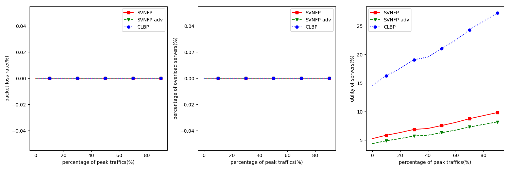
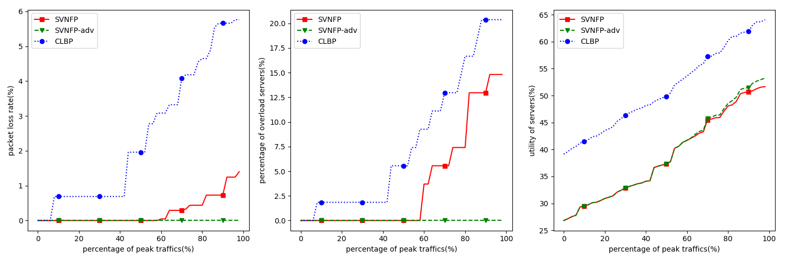
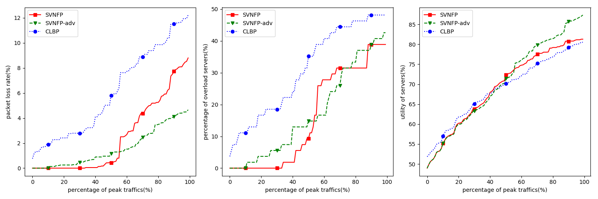
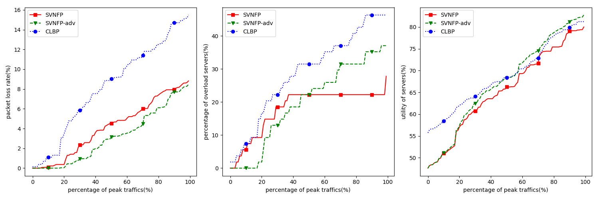
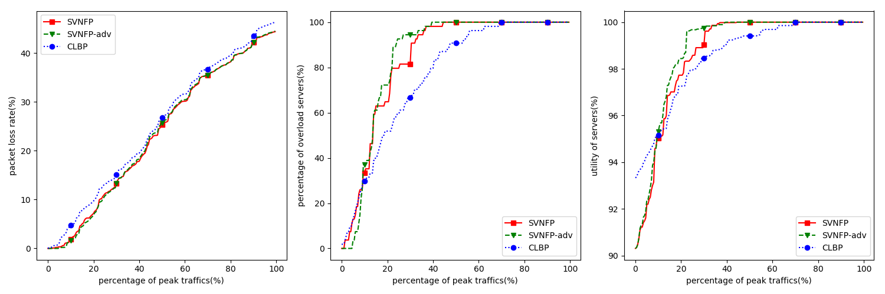

# 测试

取k=6, 共54台服务器 [45,98]。

6个pod         [45-98]
每个pod3个tor   [45-53] ...
每个tor3台serv  [45-47] [48-50] [51-53] ...

## 实验1：

```shell
# --- k=6 c=10 s=10 ---
# 生成流量
python3 traffic.py -c 10 -k 6 -Tm 10 -al 2.1 -s 10 -o debug10/traffic.txt
python3 mvsh.py -k 6 -i debug10/traffic.txt -o debug10/result_mvsh.txt -n
python3 resultAnalysis.py -c 10 -k 6 -i debug10/result_mvsh.txt -o debug10/analysis_mvsh.txt
python3 plr.py -c 10 -k 6 -i debug10/result_mvsh.txt -s 10 -o debug10/plr_mvsh.txt
python3 svnfp.py -k 6 -i debug10/traffic.txt -o debug10/result_svnf.txt -n
python3 resultAnalysis.py -c 10 -k 6 -i debug10/result_svnf.txt -o debug10/analysis_svnf.txt
python3 plr.py -c 10 -k 6 -i debug10/result_svnf.txt -s 10 -o debug10/plr_svnf.txt
python3 clbp.py -k 6 -i debug10/traffic.txt -o debug10/result_clbp.txt -n
python3 resultAnalysis.py -c 10 -k 6 -i debug10/result_clbp.txt -o debug10/analysis_clbp.txt
python3 plr.py -c 10 -k 6 -i debug10/result_clbp.txt -s 10 -o debug10/plr_clbp.txt
python3 draw.py -c 10
```

| 算法       | AR    | FLP（跳数） | AVG SU  |
| ---       | ---   | ---        | ---     |
| SVNFP     | 100%  |  3.803     |17.547%  |
| SVNFP-adv | 100%  |  2.025     | 4.094%  |
| CLBP      | 100%  |  1.271     |13.647%  |



## 实验2

```shell
# --- k=6 c=50 s=10 ---
# 生成流量
python3 traffic.py -c 50 -k 6 -Tm 10 -al 2.1 -s 10 -o debug50/traffic.txt
python3 mvsh.py -k 6 -i debug50/traffic.txt -o debug50/result_mvsh.txt -n
python3 resultAnalysis.py -c 50 -k 6 -i debug50/result_mvsh.txt -o debug50/analysis_mvsh.txt
python3 plr.py -c 50 -k 6 -i debug50/result_mvsh.txt -s 10 -o debug50/plr_mvsh.txt
python3 svnfp.py -k 6 -i debug50/traffic.txt -o debug50/result_svnf.txt -n
python3 resultAnalysis.py -c 50 -k 6 -i debug50/result_svnf.txt -o debug50/analysis_svnf.txt
python3 plr.py -c 50 -k 6 -i debug50/result_svnf.txt -s 10 -o debug50/plr_svnf.txt
python3 clbp.py -k 6 -i debug50/traffic.txt -o debug50/result_clbp.txt -n
python3 resultAnalysis.py -c 50 -k 6 -i debug50/result_clbp.txt -o debug50/analysis_clbp.txt
python3 plr.py -c 50 -k 6 -i debug50/result_clbp.txt -s 10 -o debug50/plr_clbp.txt
python3 draw.py -c 50
```

| 算法       | AR    | FLP（跳数） | AVG SU  |
| ---       | ---   | ---        | ---     |
| SVNFP     | 100%  |  5.094     |26.127%  |
| SVNFP-adv | 100%  |  2.144     |26.127%  |
| CLBP      | 100%  |  1.078     |37.128%  |



## 实验3

```shell
# --- k=6 c=100 s=10 ---
python3 traffic.py -c 100 -k 6 -Tm 10 -al 2.1 -s 10 -o debug100/traffic.txt
python3 mvsh.py -k 6 -i debug100/traffic.txt -o debug100/result_mvsh.txt -n
python3 resultAnalysis.py -c 100 -k 6 -i debug100/result_mvsh.txt -o debug100/analysis_mvsh.txt
python3 plr.py -c 100 -k 6 -i debug100/result_mvsh.txt -s 10 -o debug100/plr_mvsh.txt
python3 svnfp.py -k 6 -i debug100/traffic.txt -o debug100/result_svnf.txt -n
python3 resultAnalysis.py -c 100 -k 6 -i debug100/result_svnf.txt -o debug100/analysis_svnf.txt
python3 plr.py -c 100 -k 6 -i debug100/result_svnf.txt -s 10 -o debug100/plr_svnf.txt
python3 clbp.py -k 6 -i debug100/traffic.txt -o debug100/result_clbp.txt -n
python3 resultAnalysis.py -c 100 -k 6 -i debug100/result_clbp.txt -o debug100/analysis_clbp.txt
python3 plr.py -c 100 -k 6 -i debug100/result_clbp.txt -s 10 -o debug100/plr_clbp.txt
python3 draw.py -c 100
```

| 算法       | AR    | FLP（跳数） | AVG SU  |
| ---       | ---   | ---        | ---     |
| SVNFP     | 100%  |  5.009     |46.511%  |
| SVNFP-adv | 100%  |  2.181     |46.511%  |
| CLBP      | 100%  |  1.282     |50.232%  |



```shell
# --- k=6 c=100 s=30 ---
python3 traffic.py -c 100 -k 6 -Tm 10 -al 2.1 -s 30 -o debug100-3/traffic.txt
python3 mvsh.py -k 6 -i debug100-3/traffic.txt -o debug100-3/result_mvsh.txt -n
python3 resultAnalysis.py -c 100 -k 6 -i debug100-3/result_mvsh.txt -o debug100-3/analysis_mvsh.txt
python3 plr.py -c 100 -k 6 -i debug100-3/result_mvsh.txt -s 30 -o debug100-3/plr_mvsh.txt
python3 svnfp.py -k 6 -i debug100-3/traffic.txt -o debug100-3/result_svnf.txt -n
python3 resultAnalysis.py -c 100 -k 6 -i debug100-3/result_svnf.txt -o debug100-3/analysis_svnf.txt
python3 plr.py -c 100 -k 6 -i debug100-3/result_svnf.txt -s 30 -o debug100-3/plr_svnf.txt
python3 clbp.py -k 6 -i debug100-3/traffic.txt -o debug100-3/result_clbp.txt -n
python3 resultAnalysis.py -c 100 -k 6 -i debug100-3/result_clbp.txt -o debug100-3/analysis_clbp.txt
python3 plr.py -c 100 -k 6 -i debug100-3/result_clbp.txt -s 30 -o debug100-3/plr_clbp.txt
python3 draw3.py -c 100
```

| 算法       | AR    | FLP（跳数） | AVG SU  |
| ---       | ---   | ---        | ---     |
| SVNFP     |  98%  |  4.865     |43.700%  |
| SVNFP-adv |  99%  |  2.173     |43.160%  |
| CLBP      | 100%  |  1.398     |52.211%  |



```shell
# --- k=6 c=100 s=30 ---
python3 traffic.py -c 100 -k 6 -Tm 10 -al 2.1 -s 20 -o debug100-2/traffic.txt
python3 mvsh.py -k 6 -i debug100-2/traffic.txt -o debug100-2/result_mvsh.txt -n
python3 resultAnalysis.py -c 100 -k 6 -i debug100-2/result_mvsh.txt -o debug100-2/analysis_mvsh.txt
python3 plr.py -c 100 -k 6 -i debug100-2/result_mvsh.txt -s 20 -o debug100-2/plr_mvsh.txt
python3 svnfp.py -k 6 -i debug100-2/traffic.txt -o debug100-2/result_svnf.txt -n
python3 resultAnalysis.py -c 100 -k 6 -i debug100-2/result_svnf.txt -o debug100-2/analysis_svnf.txt
python3 plr.py -c 100 -k 6 -i debug100-2/result_svnf.txt -s 20 -o debug100-2/plr_svnf.txt
python3 clbp.py -k 6 -i debug100-2/traffic.txt -o debug100-2/result_clbp.txt -n
python3 resultAnalysis.py -c 100 -k 6 -i debug100-2/result_clbp.txt -o debug100-2/analysis_clbp.txt
python3 plr.py -c 100 -k 6 -i debug100-2/result_clbp.txt -s 20 -o debug100-2/plr_clbp.txt
python3 draw2.py -c 100
```

| 算法       | AR    | FLP（跳数） | AVG SU  |
| ---       | ---   | ---        | ---     |
| SVNFP     |  98%  |  4.865     |43.700%  |
| SVNFP-adv |  99%  |  2.173     |43.160%  |
| CLBP      | 100%  |  1.398     |52.211%  |


## 实验4

```shell
# --- k=6 c=200 ---
# 生成流量
python3 traffic.py -c 200 -k 6 -Tm 10 -al 2.1 -s 10 -o debug200/traffic.txt
python3 mvsh.py -k 6 -i debug200/traffic.txt -o debug200/result_mvsh.txt -n
python3 resultAnalysis.py -c 200 -k 6 -i debug200/result_mvsh.txt -o debug200/analysis_mvsh.txt
python3 plr.py -c 200 -k 6 -i debug200/result_mvsh.txt -s 10 -o debug200/plr_mvsh.txt
python3 svnfp.py -k 6 -i debug200/traffic.txt -o debug200/result_svnf.txt -n
python3 resultAnalysis.py -c 200 -k 6 -i debug200/result_svnf.txt -o debug200/analysis_svnf.txt
python3 plr.py -c 200 -k 6 -i debug200/result_svnf.txt -s 10 -o debug200/plr_svnf.txt
python3 clbp.py -k 6 -i debug200/traffic.txt -o debug200/result_clbp.txt -n
python3 resultAnalysis.py -c 200 -k 6 -i debug200/result_clbp.txt -o debug200/analysis_clbp.txt
python3 plr.py -c 200 -k 6 -i debug200/result_clbp.txt -s 10 -o debug200/plr_clbp.txt
python3 draw.py -c 200
```

| 算法       | AR    | FLP（跳数） | AVG SU  |
| ---       | ---   | ---        | ---     |
| SVNFP     |  87%  |  4.579     |74.537%  |
| SVNFP-adv |  80%  |  2.021     |70.888%  |
| CLBP      |75.5%  |  1.275     |72.735%  |


